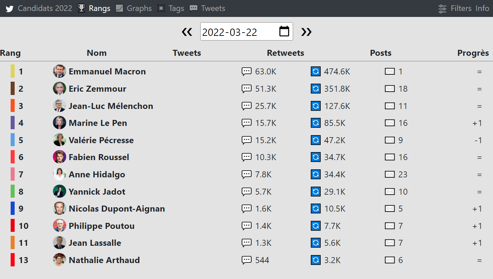
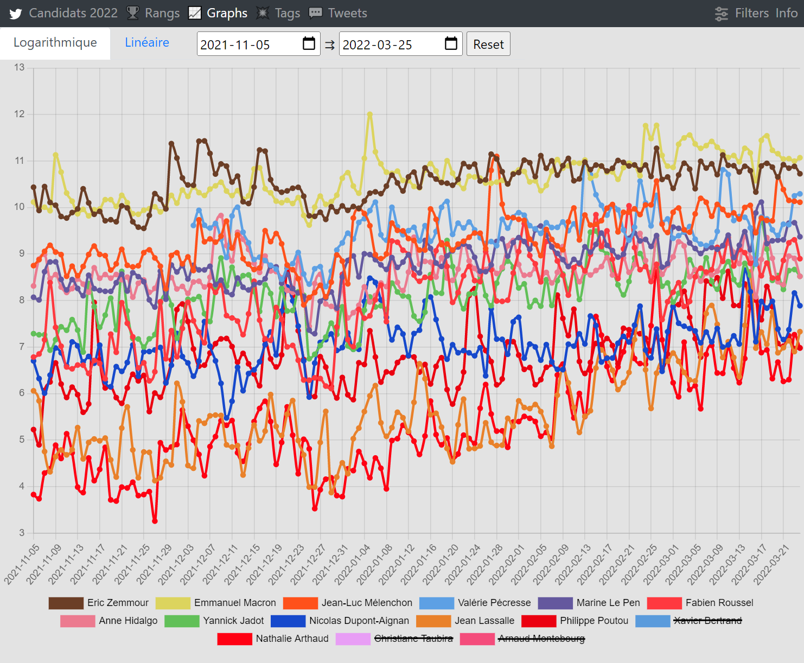
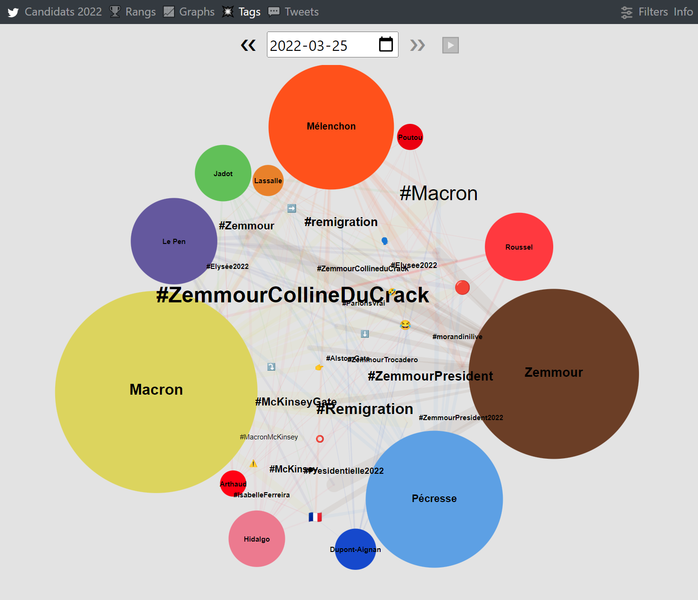
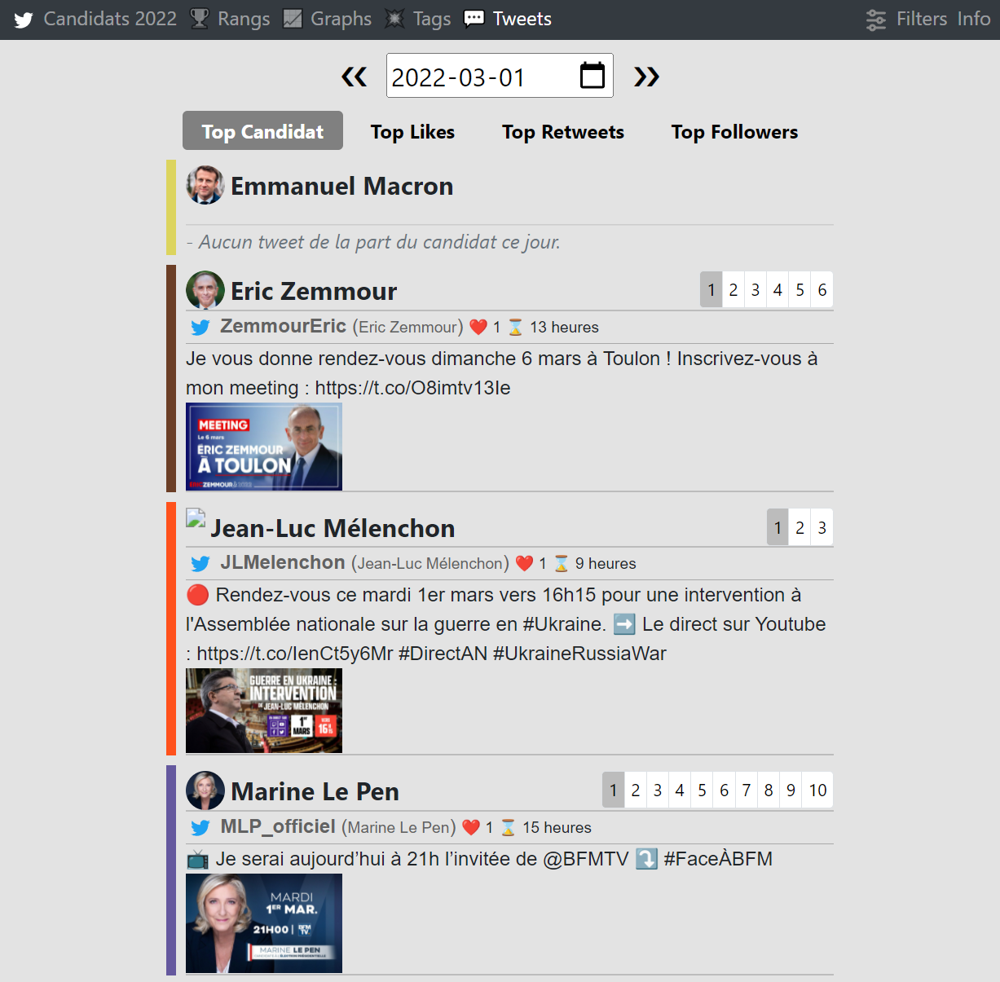

# chétane

A little project that displays a ranking of french presidential candidates' visibility on Twitter.

live demo here: https://pres2022.fr/







# run the code
Get a twitter developper account and credentials.
Copy chétane.conf.local to chétane.conf and edit it to store your consumer and access tokens.
Then you can do:

```shell
git clone https://github.com/ixty/chétane
cd chétane
# recommended:
    # python3 -m venv venv
    # venv/bin/activate
pip install -r requirements.txt
python -m chétane source # this will start the data acquisition
python -m chétane process <date in YYYY-MM-DD format> # this will process all stored tweets for the specific day
python -m chétane server # this will start a webserver on localhost:8080
```

